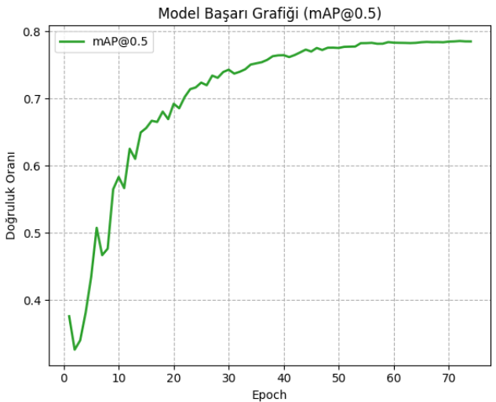
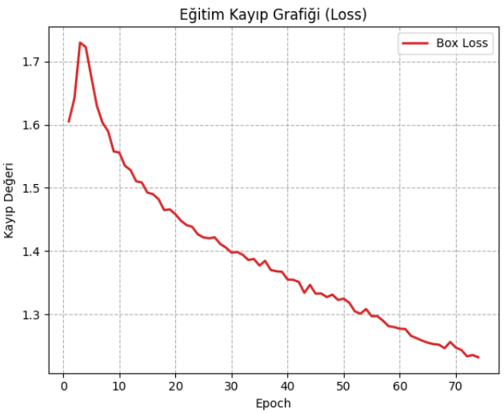
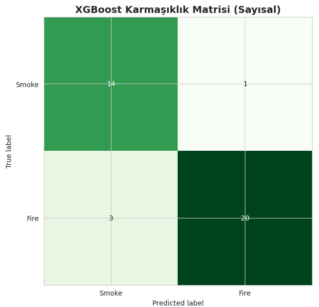
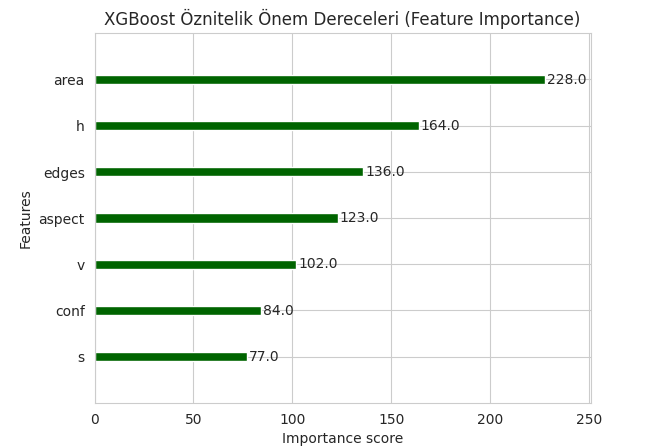

# 🛡️ Hybrid Fire & Smoke Detection (YOLOv11 + XGBoost)

This project is a high-performance fire and smoke detection system developed as a **Computer Engineering Design Project**. It combines deep learning (**YOLOv11**) for object localization with machine learning (**XGBoost**) for advanced feature verification to minimize false positives.

## 🧐 Problem & Solution
Standard object detection models can sometimes misinterpret bright lights as fire or fog as smoke. This hybrid approach solves this by:
1.  **Detection:** YOLOv11 identifies candidate regions (bounding boxes).
2.  **Feature Extraction:** Advanced features like **HSV Color Space**, **Laplacian Texture Analysis**, and **Geometric Aspects** are extracted from these regions.
3.  **Refinement:** An XGBoost-based hybrid layer analyzes these features to provide a final, highly accurate decision.


## 🛠️ Technologies
* **Python** 3.10+
* **YOLOv11** (Ultralytics)
* **XGBoost** (Gradient Boosting)
* **OpenCV** (Image Processing)
* **Scikit-learn** (Performance Metrics)

## 📊 Performance Analysis
The hybrid model significantly improves the detection reliability by filtering out environmental noise.

### 1. Training Metrics (mAP@0.5 & Loss)
The following charts show the model's convergence and accuracy improvement over 100 epochs:



### 2. Confusion Matrix
The distribution of correct vs. incorrect predictions for Fire and Smoke classes:



### 3. Feature Importance (XGBoost)
This chart illustrates which features (Hue, Texture, Aspect Ratio, etc.) the XGBoost model prioritizes when refining YOLO's results:



## 🚀 Usage

### Installation
1. Clone the repository:
   ```bash
   git clone [https://github.com/mucahitdmr61/Hybrid-Fire-Detection.git](https://github.com/mucahitdmr61/Hybrid-Fire-Detection.git)
